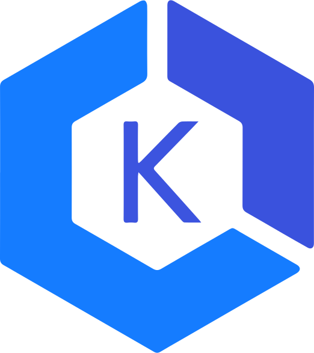
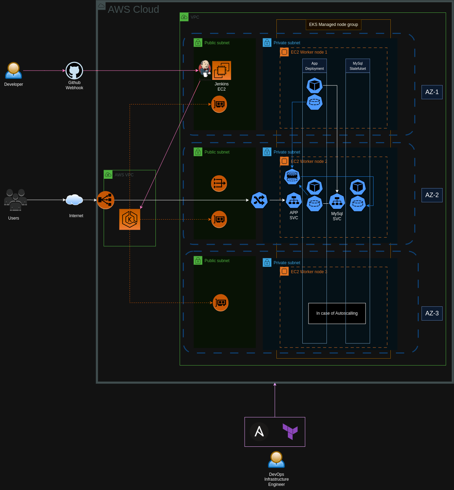

<a name="readme-top"></a>


<!-- PROJECT LOGO -->
<br />
<div align="center">
  <a href="https://github.com/abdulrahman102/DevOps-Project">
    
  </a>

  <h3 align="center">Capstone-project</h3>

  <p align="center">
    Deployment of FlaskApp into a Kubernetes cluster 
    <br />
    <a href="Terraform/">Infrastructure files</a>
    ·
    <a href="Ansible/">Configuration files</a>    
    .
    <a href="K8s/">Kubernetes files</a>
    ·
    <a href="MySQL-and-Python/">App & DOCKER files</a>
  </p>
</div>


<!-- TABLE OF CONTENTS -->
<details>
  <summary>Table of Contents</summary>
  <ol>
    <li><a href="#about">about</a></li>
    <li><a href="#pre">Prerequisites</a></li>
    <li><a href="#install">Installation</a></li>
    <li><a href="#final">Final product</a></li>

  </ol>
</details>


<!-- ABOUT THE PROJECT -->
## About The Project
<a name="about"></a>

This repo contains the full files to deploy a Flask/Mysql app to AWS cloud for a DevOps implementation.



<p align="right">(<a href="#readme-top">back to top</a>)</p>


-----
### Built With
<a name="about"></a>


* ![AWS]
* ![KUBERNETES]
* ![JENKINS]
* ![ANSIBLE]
* ![DOCKER]


<p align="right">(<a href="#readme-top">back to top</a>)</p>

-----


<!-- GETTING STARTED -->
## DOCUMENTATIONS
<a name="about"></a>


This is a guide to run the files with a final product look.

_For more explanation of the code, [Documentation](DOCS.md)_

<p align="right">(<a href="#readme-top">back to top</a>)</p>

## Getting Started

This a full instruction for running the infrastructure and the pipeline.

### Prerequisites
<a name="pre"></a>


Before running the bash script for the first time, you must run this command.
* Terraform
  ```sh
  terraform init
  ```
You must put the ssh key inside Ansible directory.
* SSH
  ```sh
  ./Ansible/ssh_key.pem
  ```

### Installation
<a name="install"></a>


_ Starting the infrastructutre (Make sure your AWS credentials are in the default path ~/.aws/credentials) _

1. Enter your variables values to a terraform.tfvars file.
- For more information about the variables, check [variables.tf](https://github.com/abdulrahman102/Complete-DevOps-Project/blob/master/Terraform/variables.tf) file.
    ```sh
    ./Terraform/terraform.tfvars
    ```
2. Run Run.sh bash script.
    ```sh
    chmod 777 Run.sh
    ./Run.sh
    ```
3. Get Jenkins Environment Variables.
   

4. Login to Jenkins site.
   
   

5. Start pipeline and inject the environment variable.
   ```
    CR_URL=VALUE1
    REPO_NAME=VALUE2
    CLUSTER_NAME=VALUE3
   ```
6. **(BONUS)** You can use the webhook with github to make the a pipeline build with every push.
   ```
    Instructions can be found in https://medium.com/@developerwakeling/setting-up-github-webhooks-jenkins-and-ngrok-for-local-development-f4b2c1ab5b6
   ```
   
   

7. **(FOR TESTING)** YOU can use docker-compose file in [MySQL-and-Python](https://github.com/abdulrahman102/Complete-DevOps-Project/tree/master/MySQL-and-Python) directory to build a test application on your localhost:5002
  ```
    docker-compose up (To start)
    docker-compose down (To end)
  ```

<p align="right">(<a href="#readme-top">back to top</a>)</p>


## FINAL PRODUCT
<a name="final"></a>


<p align="right">(<a href="#readme-top">back to top</a>)</p>

<!-- USAGE EXAMPLES -->


<!-- MARKDOWN LINKS & IMAGES -->
<!-- https://www.markdownguide.org/basic-syntax/#reference-style-links -->
[AWS]: https://img.shields.io/badge/aws-yellow?style=for-the-badge&logo=amazonaws
[KUBERNETES]: https://img.shields.io/badge/KUBERNETES-black?style=for-the-badge&logo=kubernetes
[JENKINS]: https://img.shields.io/badge/JENKINS-white?style=for-the-badge&logo=jenkins
[ANSIBLE]: https://img.shields.io/badge/ANSIBLE-black?style=for-the-badge&logo=ansible
[DOCKER]: https://img.shields.io/badge/DOCKER-grey?style=for-the-badge&logo=docker


